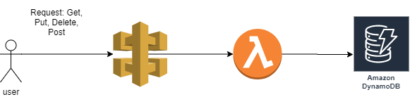

# Terraform

A simple example of a serverless architecture with API Gateway, Lambda, DynamoDB, deployed with Terraform.

## How does it work

Api gateway has different methods (delete, put, update, put) and when interacting with them they invoke a lambda function that interacts with Dynamodb.

Schema in the database

```
{
   "gameTitle": "Halo ODST",
   "gamseId" :  "ed8afb30-79c8-11ea-a9a8-55178b3f9892"
   "gameDescription": "Test"
}
```
For the delete, put and get methods it is necessary to send a gameId parameter

```
https://base_url/games?gameId=ed8afb30-79c8-11ea-a9a8-55178b3f9892
```

### Architecture

 

### Deployment

Update main.tf with appropriate AWS CLI profile and stack name values.

```
terraform init
terraform apply
``` 

## Authors

* **Luis Sic** - *TT* - [117](https://github.com/LuisSic)


## License

This project is licensed under the MIT License - see the [LICENSE.md](LICENSE.md) file for details
